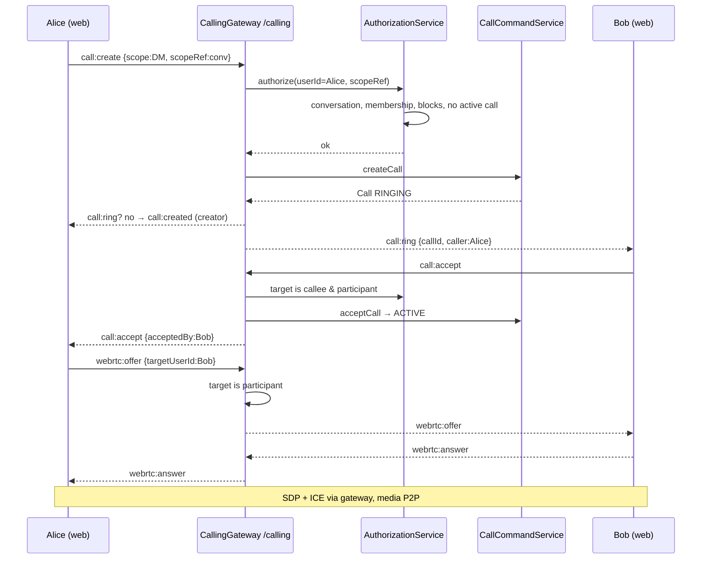
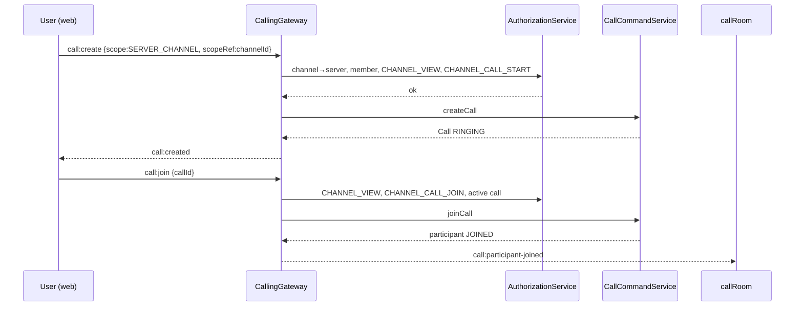

# Calling Integration Contract
**Phase 2 — defined contracts, no implementation yet.**
Applies to `src/modules/calling/`, `src/modules/direct-messages/`, `src/modules/servers/`, `src/modules/messages/`, `src/modules/notifications/`, `src/modules/realtime/`.

---

## 0. Ownership (inviolable)

| Domain | Owns |
|---|---|
| **DM** | conversation existence, the 1:1 pair, block/privacy checks, message history |
| **Server/Channel** | server membership, roles, permissions (incl. channel overwrites), channel config |
| **Calling** | call lifecycle, state machine, participants, signaling (SDP/ICE), mute/camera, termination |
| **Realtime** | socket auth, connection, rooms, event delivery, presence |
| **WebRTC** | media transport only (P2P; SFU is a future path, not implemented) |
| **Notifications** | missed/incoming call notifications downstream of Calling |

Rule: *DMs/Channels authorize the context. Calling owns the call. Realtime owns delivery. Browser owns media.*

No module other than `calling/` may create/join/mutate `Call`/`CallParticipant`.

---

## 1. DM → Calling

### Flow
```
DM client ─ call:create { type, scope: DM, scopeRef: conversationId, deviceId? }
   │ Calling AuthorizationService (calling module)
   │   ├─ conversation exists (DirectMessageChannelRepository)
   │   ├─ type check: channel is a 1:1 DirectMessageChannel (no GROUP type exists today)
   │   ├─ caller ∈ { userAId, userBId }
   │   ├─ target = the other participant
   │   ├─ block check both directions (UserSocialRepository.existsBlock)
   │   ├─ no active call already in conversation (idempotency: 1 active per conversation)
   │   ▼
   CallCommandService.createCall → Call(status=RINGING) + creator participant (JOINED)
   │
   │ emits call:ring { callId, type, caller } to call:user:{targetId}
   ▼
Target
   ├─ call:accept  → CallCommandService.acceptCall(callId)   [callee-authorized]
   ├─ call:reject  → CallCommandService.rejectCall(callId)   [callee-authorized]
   └─ (timeout/offline) → MISSED_CALL notification
```

### Authorization deltas required in Calling (current module is creator-only)
- `call:cancel`  → **creator**, while `RINGING` (unchanged).
- `call:accept` / `call:reject` → **the ringing callee** (non-creator) for a DM scope call. Today these are creator-only — this is a behavioral contract change.
- `call:end` → any currently-connected participant **or** the creator.
- Signaling (`webrtc:offer/answer/ice-candidate`) target must be a current `CallParticipant` of the same call (prevents signaling injection / IDOR).
- Mute/camera: self-only, but `call:mute` handler today hardcodes `targetUserId = userId`; contract keeps self-only at gateway.

### Contract with Block
If either direction is blocked → reject `call:create` with `FORBIDDEN` (message: `CALL_NOT_ALLOWED`). Never leak that the block exists in the notification payload.

---

## 2. Channel → Calling

```
Channel client ─ call:create { type, scope: SERVER_CHANNEL, scopeRef: channelId }
   │ Calling AuthorizationService
   │   ├─ channel = ServerChannelQueryService.getChannelOrThrow(channelId)
   │   ├─ serverId derived from channel (NO redundant serverId in payload)
   │   ├─ member = ServerMemberQueryService.getMemberOrThrow(serverId, userId)
   │   ├─ requirePermission(serverId, userId, CHANNEL_VIEW, channelId)
   │   ├─ requirePermission(serverId, userId, CHANNEL_CALL_START, channelId)   [new permission]
   │   ▼
   CallCommandService.createCall → RINGING
```

`call:join`
```
   │ requirePermission(serverId, userId, CHANNEL_VIEW, channelId)
   │ requirePermission(serverId, userId, CHANNEL_CALL_JOIN, channelId)   [new permission]
   │ active RINGING/ACTIVE call exists for scope
   ▼
   CallCommandService.joinCall
```

### New `ServerPermission` values (enum additions)
`CHANNEL_CALL_START`, `CHANNEL_CALL_JOIN`, `CHANNEL_CALL_MANAGE`.
- `CHANNEL_CALL_START` required to create a channel call.
- `CHANNEL_CALL_JOIN` required to join (applies to `call:join`).
- `CHANNEL_CALL_MANAGE` grants mute/camera-of-others + force end (future-hardening; not gatekept today).
- `ADMINISTRATOR` already implies everything via the resolver.

Reuses `resolvePermissions` + channel overwrites + 30s cache unchanged.

---

## 3. Calling → Realtime

- Namespace `/calling` and all event names are **unchanged** (no duplicate events introduced).
- Cross-node fan-out already works via `RedisIoAdapter` (socket.io redis adapter); **no second transport**.
- `CALL_EVENT_CHANNEL = 'calling:events'` (Redis pub/sub) becomes the server-side lifecycle bus for: call created/ended (for metrics, missed-call detection, future moderation). Consumed by new `CallingEventListenerService`.
- Channel "N in call" presence: no polling. Channel call participants listen to `call:participant-joined` / `call:participant-left` on the call room (they hold the channel room via the realtime module if desired). Presence badge = count of living participants.
- `call:stun-turn-config` remains the ICE source; contract reserves an `IceServerProvider` seam (STUN today, TURN later) — implementation stays STUN-only.

---

## 4. Calling → Notifications

- Calling publishes `DomainNotificationEvent` on `notifications:domain-events` (RedisPubSubService) — never calls `NotificationCommandService` directly.
- New `NotificationType` values: `CALL_INCOMING` (ring to offline/push target), `MISSED_CALL`.
- New `NotificationEntityType` values: reuse `DIRECT_MESSAGE_CHANNEL` / add `CHANNEL`.
- `CALL_INCOMING` ─ emitted on `call:create`; suppressed for the online target covered by live ringing.
- `MISSED_CALL` ─ on `REJECTED`, `CANCELLED`, `ENDED`-without-accept, or ring-timeout.
- Payload: `{ callId, scope, callType, initiatorUserId, conversationId?, channelId? }`. **Never** message content or presence of other participants beyond initiator.

---

## 5. Error model & idempotency

- Keep the 5 generic WS codes (`UNAUTHORIZED | FORBIDDEN | INVALID_REQUEST | NOT_FOUND | INTERNAL_ERROR`) with descriptive `message` strings (`CALL_NOT_FOUND`, `CALL_ALREADY_ENDED`, `NOT_CALL_PARTICIPANT`, `CALL_NOT_ALLOWED`, `CALL_ALREADY_ACTIVE`). No new top-level codes.
- One active call per scope enforced at creation (unique via check-then-create in the `CallRepository` transaction, `@@index([scope, scopeRef])` lookup).
- Replay guard: state machine rejects transitions from wrong status (e.g., `ENDED → ACCEPTED`).

---

## 6. State machine (unchanged, now enforced as contract)

```
RINGING ──accept──► ACTIVE ──end/last-leave──► ENDED
   │──reject──► REJECTED
   │──cancel──► CANCELLED
ACTIVE ──leave────► (last) ENDED
```
Participant: `JOINED ⇄ MUTED`, `JOINED ⇄ CAMERA_OFF`, `* → LEFT`. Transient WebRTC/SDP/ICE state is never persisted.

---

## 7. Sequence (DM voice)



---

## 8. Sequence (channel join)



---

## 9. Out of scope (Phase 2+ guard rails)

- No SFU/mediasoup/Janus/Kafka/Twilio/Agora/LiveKit. Not evaluated unless later explicitly required.
- No E2EE claims: WebRTC transport encryption ≠ app-level E2EE. No custom crypto.
- No call-as-message: system/missed-call *rendering* in DM history is a Messaging-domain concern and is deferred; Calling never writes to `DirectMessage`.