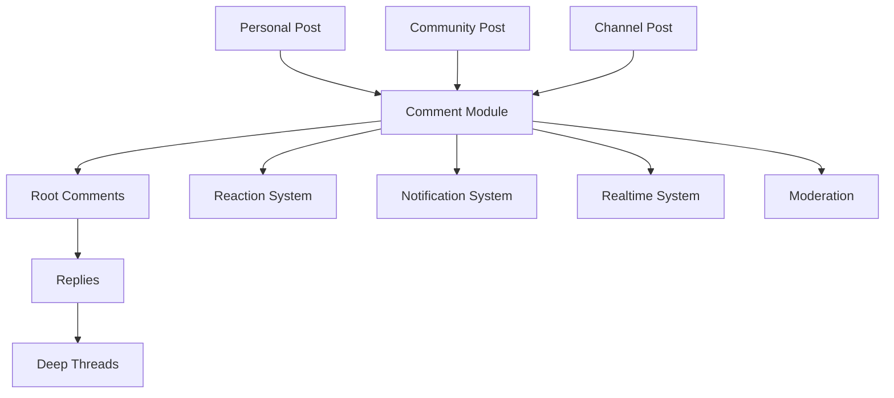

# Comment & Thread Module

## Purpose

Shared Comment + Reddit-style Thread system for Nexus. One module, three post types.

## Supported Post Types

| Post Type | Prisma Model | Discriminator |
|---|---|---|
| Personal Post | `Post` (no communityId/channelId) | `PERSONAL` |
| Community Post | `CommunityPost` | `COMMUNITY` |
| Channel Post` | `Post` (with channelId) | `CHANNEL` |

## Architecture

## Responsibility Boundaries

**Comment Module owns:**
- Comment CRUD (create, read, update, soft-delete)
- Thread hierarchy (parent-child relationships)
- Comment reactions/votes (upvote/downvote)
- Comment counts (denormalized on Comment and Post)
- Comment events (created, updated, deleted, reaction changed)

**Owning domains remain responsible for:**
- Post existence and visibility
- Post ownership
- Community membership and permissions
- Server/channel authorization
- Domain-specific moderation rules

## Security Rules

- Backend validates `postId` exists and is visible to the requesting user
- Backend validates `parentCommentId` belongs to the same `postId` (cross-post attack prevention)
- Never trust client-provided `postId` or `parentCommentId` for authorization decisions
- Blocked users cannot see or interact with each other's comments
- Deleted/suspended users' comments are soft-deleted, not cascade-deleted
