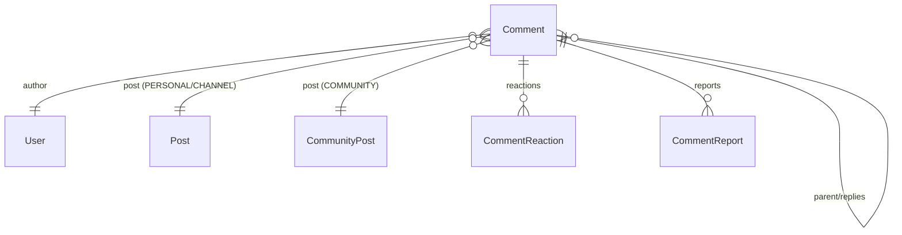
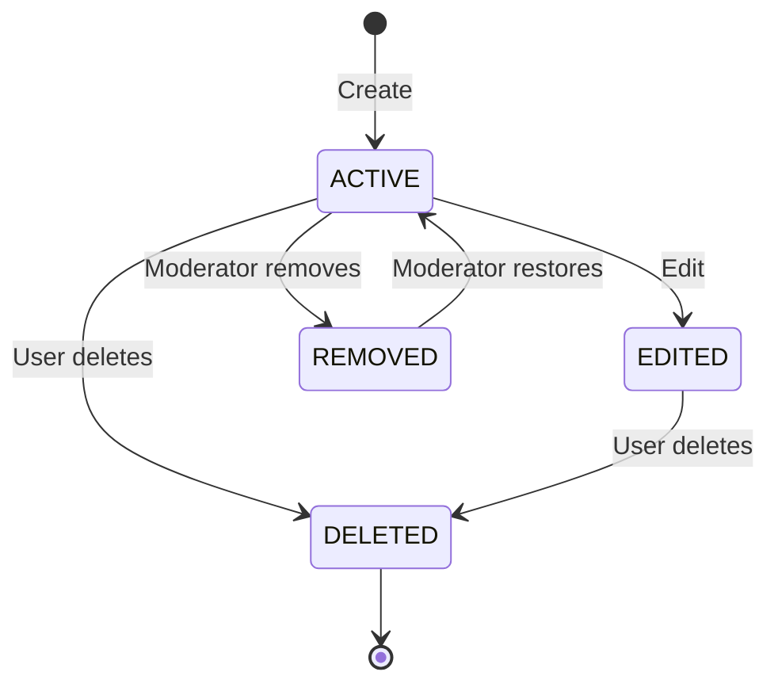

# Comment Domain

## Entity: Comment

### Fields

| Field | Type | Description |
|---|---|---|
| `id` | `String` (cuid) | Primary key |
| `postId` | `String` | References Post.id or CommunityPost.id |
| `postType` | `CommentPostType` | Discriminator: PERSONAL, COMMUNITY, CHANNEL |
| `parentCommentId` | `String?` | Null = root comment, non-null = reply |
| `authorId` | `String` | References User.id |
| `content` | `String` | Comment text (max 10,000 chars) |
| `status` | `CommentStatus` | ACTIVE, EDITED, DELETED, REMOVED |
| `upvoteCount` | `Int` | Denormalized upvote count |
| `downvoteCount` | `Int` | Denormalized downvote count |
| `replyCount` | `Int` | Denormalized direct reply count |
| `version` | `Int` | Optimistic locking version |
| `createdAt` | `DateTime` | Creation timestamp |
| `updatedAt` | `DateTime` | Last update timestamp |
| `editedAt` | `DateTime?` | Last edit timestamp |
| `deletedAt` | `DateTime?` | Soft delete timestamp |

### Relationships

## Commands

| Command | Description |
|---|---|
| `CreateComment` | Create root comment on a post |
| `ReplyToComment` | Create reply to existing comment |
| `EditComment` | Update comment content |
| `DeleteComment` | Soft-delete own comment |
| `RemoveComment` | Moderator soft-delete |
| `RestoreComment` | Moderator restore |

## Queries

| Query | Description |
|---|---|
| `ListRootComments` | Get root comments for a post (cursor-paginated) |
| `ListReplies` | Get replies to a comment (cursor-paginated) |
| `GetComment` | Get single comment with viewer state |

## State Diagram

## Sorting Modes

| Mode | Order |
|---|---|
| `BEST` | `score DESC, createdAt ASC, id ASC` |
| `TOP` | `upvoteCount DESC, createdAt ASC, id ASC` |
| `NEW` | `createdAt DESC, id DESC` |
| `OLD` | `createdAt ASC, id ASC` |

Where `score = upvoteCount - downvoteCount`.
